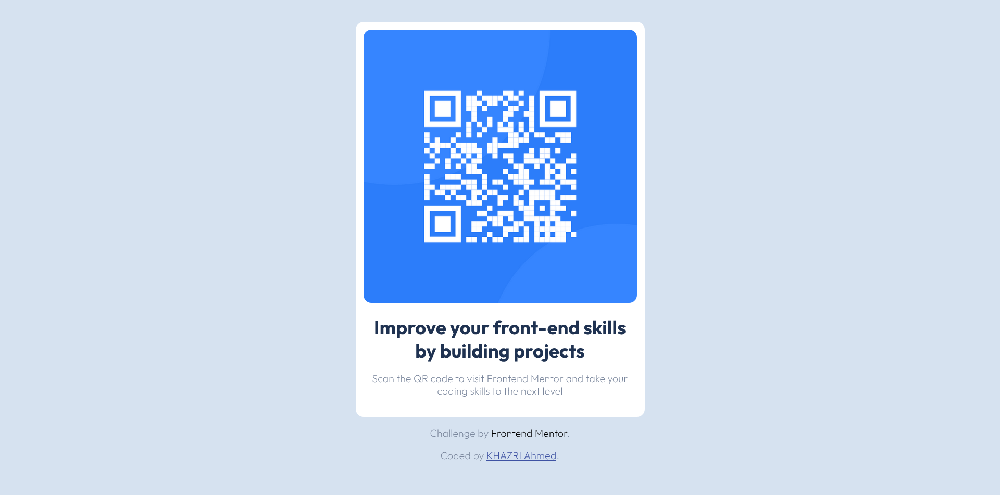

# Frontend Mentor - QR code component solution

This is a solution to the [QR code component challenge on Frontend Mentor](https://www.frontendmentor.io/challenges/qr-code-component-iux_sIO_H). Frontend Mentor challenges help you improve your coding skills by building realistic projects. 

## Table of contents

- [Overview](#overview)
  - [Screenshot](#screenshot)
  - [Links](#links)
- [My process](#my-process)
  - [Built with](#built-with)
- [Author](#author)

## Overview

### Screenshot
-desktop

-mobile

### Links

- Solution URL: [Add solution URL here](https://github.com/AhmedKhazri/qr-code-component)
- Live Site URL: [live Site](https://ahmedkhazri.github.io/qr-code-component/)

### Built with

- Semantic HTML5 markup
- CSS custom properties
- desktop-first workflow

## Author

- Frontend Mentor - [@AhmedKhazri](https://www.frontendmentor.io/profile/AhmedKhazri)
- Twitter - [@ahmed95khazri](https://twitter.com/ahmed95khazri)
